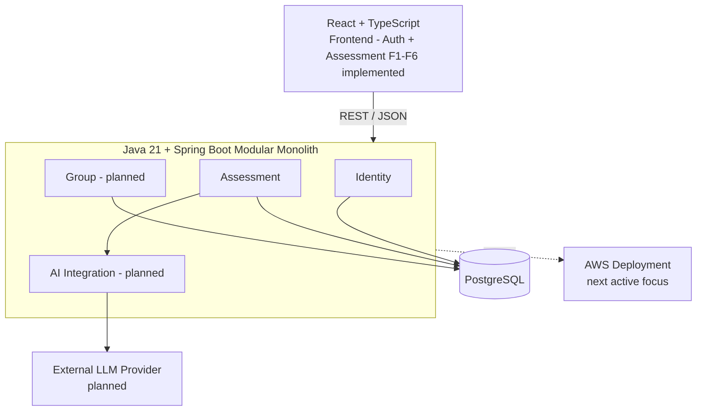

# Spring AWS Portfolio

**日本語** | [English](./README.md)

React + TypeScript / Java + Spring Boot / PostgreSQL / AWS を中心に、**非臨床目的の personality assessment を題材として設計・開発しているフルスタック個人開発プロジェクト**です。

ユーザーは version 管理された Assessment を受け、途中保存・再開・履歴参照を行えます。判定は deterministic な scoring を基本とし、曖昧な Dimension のみを AI-assisted clarification の対象とします。将来的には Group 参加と、ユーザーが明示的に選択した Assessment 結果の共有までを実装する予定です。

このプロジェクトでは、単に機能を作ることではなく、**Domain Modeling → API Design → Persistence → Security → Testing → Frontend → Containerization → AWS → CI/CD → Infrastructure as Code** までを一貫して設計・実装・説明できることを目標としています。

> **現在の Backend:** Assessment **Step 7 完了 — deterministic Clarification + Tie-break workflow**<br>
> **現在の Frontend:** **F1-F6 完了 — Authentication + deterministic Assessment flow を Result / History まで実装**<br>
> **次の主な作業:** **AWS deployment / Containerization / Terraform / GitHub Actions CI/CD**。provider-backed LLM interaction、Group / Sharing、cross-domain historical deletion は意図的に後続へ defer しています。

---

## プロジェクト概要

最終 MVP は、主に次の 2 つの機能領域で構成します。

### 1. Personality Assessment

- ユーザー登録 / Login / Logout
- version 管理された Assessment の Start / Resume
- Questionnaire の autosave
- immutable な submission boundary を通じた回答確定
- deterministic scoring と ambiguity 判定
- ambiguous な Dimension に対する AI-assisted clarification または user tie-break
- 完了済み Assessment の履歴参照・管理

### 2. Group & Explicit Sharing

- Group の作成 / 参加
- Membership と Admin 権限の管理
- 完了済み Assessment から 1 件を明示的に選択して Group に共有
- Questionnaire 回答、private clarification context、全履歴、Account 情報はデフォルトで非公開

本プロジェクトの Assessment は医療・心理診断を目的としたものではありません。また、AI は scoring や lifecycle の最終判断を担う source of truth ではなく、限定された補助コンポーネントとして扱います。

---

## Architecture

MVP では **Modular Monolith** を採用しています。

Identity / Assessment / Group / AI Integration を business module として分離しつつ、初期段階から Microservices を導入するのではなく、package boundary、公開 interface、architecture test、Application / Domain / Infrastructure の責務分離によって module 間の境界を維持します。



### 現在の Backend flow

```text
Register / Login / Session / CSRF
                ↓
        Assessment Catalog
                ↓
      Start / Resume / Restart
                ↓
   Session-bound Questionnaire
                ↓
             Autosave
                ↓
              Submit
                ↓
 Deterministic Scoring + Ambiguity
                ↓
   ┌────────────┴─────────────┐
   │                          │
No ambiguity              Ambiguous
   │                          │
   ↓                          ↓
Complete           Clarification lifecycle boundary
                              ↓
                     Skip current / remaining
                              ↓
                     Exact tie if unresolved?
                              ↓
                       User Tie-break
                              ↓
                           Complete
                ↓
History → Historical Detail

Provider-backed AI conversation は Backend Step 8 で実装予定です。
```

React frontend は現在、この deterministic flow を Browser から end-to-end で利用できます。Session/CSRF authentication、Questionnaire autosave/submission、Skip/Tie-break、Result provenance、completed History navigation まで実装済みです。

詳細な Architecture baseline は [`docs/architecture.md`](docs/architecture.md) にまとめています。

---

## 技術的なポイント

このプロジェクトでは、単純な CRUD 実装だけではなく、Domain・Persistence・Security・Concurrency・Testing の設計判断を明示的に扱うことを重視しています。

### 1. Assessment Session を exact DefinitionVersion に固定

各 `AssessmentSession` は、開始時点の `AssessmentDefinitionVersion` に必ず紐付きます。

Assessment 定義が将来更新されても、進行中・完了済み Session が暗黙的に新 version へ切り替わらないため、過去の結果について「どの定義で判定されたか」を再現・説明できます。

詳細: [`ADR-0002`](docs/adr/ADR-0002-bind-session-to-exact-definition-version.md)

### 2. Deterministic Scoring と AI Clarification の分離

Questionnaire の scoring と ambiguity 判定は deterministic なロジックとして実装します。

AI は、deterministic scoring によって曖昧と判定された Dimension の clarification にのみ利用します。LLM に Assessment 全体の判定や lifecycle transition を任せる設計にはしていません。

これにより、core business rule の再現性を維持しつつ、AI dependency の影響範囲を限定できます。

詳細: [`ADR-0003`](docs/adr/ADR-0003-deterministic-scoring-with-optional-ai.md), [`ADR-0004`](docs/adr/ADR-0004-dimension-scoped-clarification.md)

### 3. Initial Result と Final Result を分離

Domain 上で `InitialAssessmentResult` と `FinalAssessmentResult` を分けています。

Questionnaire から得られた deterministic evidence は immutable とし、その後の clarification / tie-break によって元の結果を書き換えません。

これにより、「最初の scoring 結果」と「最終的に確定した結果」の関係を追跡できます。

詳細: [`ADR-0005`](docs/adr/ADR-0005-separate-initial-and-final-results.md)

### 4. PostgreSQL で Concurrency Invariant を保証

重要な workflow rule を Frontend check や in-memory state のみに依存させていません。

Backend transaction、targeted row locking、database constraint、PostgreSQL partial unique index を組み合わせて、たとえば「1 user × 1 assessment definition につき active Session は 1 件だけ」といった invariant を保証します。

詳細: [`ADR-0013`](docs/adr/ADR-0013-targeted-locking-and-partial-unique-indexes.md)

### 5. Domain Model と JPA Model を分離

Domain object をそのまま JPA Entity にせず、Domain Model と Persistence Model を分離しています。

Repository adapter が両者の mapping を担当することで、database mapping の都合が Domain の設計そのものになることを避けています。

詳細: [`ADR-0010`](docs/adr/ADR-0010-separate-domain-and-jpa-models.md)

### 6. Testcontainers による実 PostgreSQL Integration Test

Persistence / concurrency の integration test では H2 ではなく、**Testcontainers 上の PostgreSQL** を利用しています。

このプロジェクトでは JSONB、partial index、constraint、row locking など PostgreSQL 固有の挙動を使用しているため、実 DB に近い環境で検証することを重視しています。

### 7. Server-side Session + CSRF

Authentication には Spring Security と Spring Session JDBC を使用し、Session を server-side に保持しています。

Browser からの state-changing request に対する CSRF protection も無効化せず、明示的に扱います。

詳細: [`ADR-0014`](docs/adr/ADR-0014-server-side-session-authentication.md)

### 8. Clarification を独立した永続化 workflow として設計

初期設計では `DimensionClarification` を `AssessmentSession` Aggregate 内部の Entity としていましたが、実装を進める中で lifecycle と external LLM call の境界を再評価し、独立した Assessment Aggregate として扱う設計へ変更しました。

短い Session row lock、local transaction、database uniqueness constraint を組み合わせ、外部 LLM call の間 DB transaction を保持しない構成にしています。

これは、実装から得た feedback をもとに設計を見直し、その変更理由を ADR として残した例でもあります。

詳細: [`ADR-0016`](docs/adr/ADR-0016-dimension-clarification-separate-aggregate.md)

### 9. Backend-authoritative な React workflow

Frontend は独自の Assessment state machine を持たず、`AssessmentSessionResponse` を authoritative state として Questionnaire / Clarification / Tie-break / Result を同じ canonical Session route 上で描画します。

TanStack Query が server state を担当し、未保存 Questionnaire draft は local state に残します。Mutation 後も Frontend が「次の step」を手動決定するのではなく、Backend が返した Session を cache に反映し、workflow resolver が次の presentation を選択します。

また real-browser integration により、MSW だけでは見つからなかった Restart response shape の誤認、React StrictMode による autosave lifecycle bug、exact-tie finalization 後の Backend response mapping failure なども発見・修正しました。

詳細: [`docs/frontend/05-implementation-checkpoint-f1-f6.md`](docs/frontend/05-implementation-checkpoint-f1-f6.md)

---

## Tech Stack

| Area | Technology | Status |
|---|---|---|
| Backend | Java 21, Spring Boot 4.1.1 | ✅ Implemented |
| Security | Spring Security, Spring Session JDBC, CSRF | ✅ Implemented |
| Database | PostgreSQL 18 | ✅ Implemented |
| Persistence | JPA / Hibernate, Flyway | ✅ Implemented |
| API | REST, OpenAPI 3.1 | ✅ Assessment Step 7 まで実装 |
| Testing | JUnit 5, Spring MVC Test, ArchUnit, Testcontainers, Vitest, RTL, MSW | ✅ 現在の Backend + Frontend scope で実装 |
| Local environment | Docker Compose | ✅ PostgreSQL 環境を実装 |
| Frontend | React + TypeScript, Vite, React Router, TanStack Query | ✅ Auth + deterministic Assessment flow を F6 まで実装 |
| AI integration | External LLM behind an adapter boundary | ⏸ Cloud/CI-CD 完了後まで deferred |
| Containerization | Docker application image | 🚧 次の active focus |
| Cloud | AWS | 🚧 次の active focus |
| CI/CD | GitHub Actions | 🚧 次の active focus |
| Infrastructure as Code | Terraform | 🚧 次の active focus |

---

## 開発状況

| Workstream | Status |
|---|---|
| Product requirements & architecture baseline | ✅ Complete |
| Sixteen Personality specification | ✅ Complete |
| Group domain design | ✅ Complete |
| Backend module / persistence / API design | ✅ Complete |
| Identity & Authentication | ✅ Complete |
| Assessment catalog + Start / Resume | ✅ Complete |
| Questionnaire autosave + Submit | ✅ Complete |
| Deterministic scoring + ambiguity | ✅ Complete |
| Restart / Start New | ✅ Complete |
| Assessment History + Historical Detail | ✅ Complete |
| Clarification + Tie-break mutation | ✅ Complete |
| External AI adapter / runtime context | ⏸ Cloud/CI-CD 完了後まで deferred |
| Historical assessment deletion | ⏸ Group sharing backend 実装後まで deferred |
| Group / Membership / Sharing implementation | ⏳ 現在の Cloud/CI-CD work 後に実装予定 |
| React frontend | ✅ 現在 executable な Auth + deterministic Assessment scope を F1-F6 まで完了 |
| Docker application image | 🚧 次の active focus |
| AWS deployment | 🚧 次の active focus |
| GitHub Actions CI/CD | 🚧 次の active focus |
| Terraform infrastructure | 🚧 次の active focus |

詳細な roadmap は [`docs/roadmap.md`](docs/roadmap.md) に記録しています。

---

## 現在実装済みの Backend 機能

### Identity & Security

- User registration
- Login / Logout
- authenticated `/me`
- Spring Security server-side Session authentication
- Spring Session JDBC persistence
- CSRF token endpoint / validation
- Infrastructure adapter 経由の Argon2id password hashing

### Assessment

- available Assessment catalog
- exact DefinitionVersion binding
- Start / Resume
- explicit Restart / Start New
- Session-bound Questionnaire read
- Questionnaire autosave
- immutable submission boundary
- deterministic scoring
- ambiguity detection
- clarification 不要時の immediate finalization
- persisted Clarification lifecycle / stale external-result protection
- Skip Current / Skip Remaining deterministic clarification mutation
- explicit exact-tie user decision / deterministic post-clarification finalization
- completed Assessment History
- historical Assessment detail
- PostgreSQL-backed read projection
- critical path に対する retry / concurrency / recovery test

現時点で executable backend に未実装なのは、provider-backed LLM interaction、historical deletion orchestration、Group / Sharing です。Historical deletion は ACTIVE な Group share を先に終了させる必要があるため、Group sharing boundary が存在するまで意図的に defer しています。

### Frontend

- React + TypeScript + Vite application shell
- Register / Login / current-user Session restore / protected routes / Logout
- in-memory CSRF management と stale-token refresh/retry
- Assessment Catalog / Detail / Start / Resume / Start New
- canonical `/assessment-sessions/:sessionId` workflow route
- Session-bound Questionnaire rendering / persisted answer restore
- debounced・serialized な full-snapshot autosave と save/error/retry state
- in-flight autosave と coordination した final Submit / already-submitted recovery
- deterministic Clarification read model / Skip Current / Skip Remaining
- exact-tie Tie-break / deterministic finalization
- per-dimension decision provenance を表示する Result read model
- completed Assessment History / URL pagination / canonical Session detail navigation
- Vitest / React Testing Library / MSW と real-browser integration verification

real provider-backed clarification、Group / Sharing UI、historical deletion UI は未実装です。現在は Frontend feature development を一旦停止し、AWS / CI-CD line に移っています。

---

## Documentation

設計上重要な判断を code comment だけに残さず、Requirements / Domain Design / OpenAPI / ADR / Implementation Checkpoint として管理しています。

```text
docs/
├── README.md                 Documentation entry point
├── requirements.md           Product goals, MVP scope and privacy rules
├── architecture.md           System and module architecture baseline
├── roadmap.md                Current progress and remaining work
├── domain/                   Assessment and Group domain design
├── api/
│   └── openapi.yaml          Machine-readable HTTP contract
├── adr/                      Architecture Decision Records
├── backend/                  Detailed backend design and implementation checkpoints
└── frontend/                 Frontend architecture + F1-F6 implementation checkpoint
```

主なドキュメント:

- [`docs/README.md`](docs/README.md) — Documentation index
- [`docs/architecture.md`](docs/architecture.md) — Architecture / system boundary
- [`docs/domain/assessment-domain.md`](docs/domain/assessment-domain.md) — Assessment lifecycle / invariant
- [`docs/domain/group-spec-aligned.md`](docs/domain/group-spec-aligned.md) — Group / Membership / Sharing rule
- [`docs/api/openapi.yaml`](docs/api/openapi.yaml) — Current OpenAPI contract
- [`docs/adr/`](docs/adr/) — Architecture Decision Records
- [`docs/backend/15-assessment-clarification-workflow-checkpoint.md`](docs/backend/15-assessment-clarification-workflow-checkpoint.md) — Latest accepted backend checkpoint
- [`docs/frontend/README.md`](docs/frontend/README.md) — Frontend architecture / implementation index
- [`docs/frontend/05-implementation-checkpoint-f1-f6.md`](docs/frontend/05-implementation-checkpoint-f1-f6.md) — F1-F6 implementation checkpoint / Cloud handoff

---

## Testing Strategy

Risk の種類に応じて test level を分けています。

- **Backend Domain tests** — Spring / DB に依存しない business rule と state transition
- **Backend Application / Web MVC tests** — Use Case orchestration、HTTP / Security / Controller contract
- **PostgreSQL integration tests** — JPA mapping、Flyway schema、constraint、JSONB、query behavior
- **Concurrency tests** — locking、uniqueness、retry / recovery
- **Architecture tests** — package / module dependency の guardrail
- **Frontend unit / integration tests** — Vitest + React Testing Library + MSW
- **Real-browser verification** — Browser -> Vite -> Spring Boot -> PostgreSQL の実 stack 確認

Backend test suite:

```bash
cd backend
./mvnw test
```

Frontend quality gates:

```bash
cd frontend
npm run test
npm run build
npm run lint
```

Dedicated Playwright E2E は、CI/CD により repeatable な full-stack environment が整った段階で追加する予定です。

---

## ローカル実行

### Prerequisites

- JDK 21
- Node.js 24 LTS
- Docker + Docker Compose
- 初回 Maven Wrapper / npm dependency install 時の Internet access

### 1. PostgreSQL を起動

Repository root で:

```bash
docker compose up -d postgres
```

Container の状態確認:

```bash
docker compose ps
```

### 2. Backend を起動

```bash
cd backend
./mvnw spring-boot:run
```

Health check:

```bash
curl http://localhost:8080/actuator/health
```

Expected response:

```json
{"status":"UP"}
```

### 3. Frontend を起動

別 terminal で:

```bash
cd frontend
npm ci
npm run dev
```

Browser で:

```text
http://localhost:5173
```

Vite は relative `/api` / `/actuator` request を Backend `8080` port へ proxy します。

### 4. Test / Build check

Backend:

```bash
cd backend
./mvnw test
```

Frontend:

```bash
cd frontend
npm run test
npm run build
npm run lint
```

---

## Database Ownership & Migration

Database schema は **Flyway が管理**します。Hibernate は mapped model と schema の整合性確認のみを行い、production schema の生成・変更には使用しません。

```text
spring.jpa.hibernate.ddl-auto=validate
```

現在の migration history:

```text
V1__create_identity_tables.sql
V2__create_spring_session_tables.sql
V3__create_assessment_tables.sql
V4__seed_sixteen_personality_v1.sql
V5__add_clarification_execution_token.sql
```

適用済み migration は immutable history として扱い、過去の design document に合わせるために renumber しません。今後の migration は `V6` 以降から追加します。

---

## Repository Structure

```text
spring-aws-portfolio/
├── backend/                  Java 21 + Spring Boot application
├── frontend/                 React + TypeScript + Vite application
├── docs/                     Requirements, architecture, ADRs and checkpoints
├── infra/
│   └── terraform/            現在の AWS phase 用 Terraform workspace
├── compose.yaml              Local PostgreSQL environment
├── .env.example              Local configuration example
├── README.md                 English / development README
└── README.ja.md              Japanese / portfolio README
```

Deterministic な full-stack Assessment slice は local で runnable です。現在の delivery phase では、この application を Docker / AWS / Terraform / GitHub Actions によって reproducible に deploy できる状態へ進めます。

---

## 設計方針

- **Business rule は Backend に置く** — Frontend の前提だけに依存しない
- **Durable invariant は restart / concurrency を越えて成立させる** — 必要に応じて Domain / Application logic と PostgreSQL constraint の両方で保証する
- **AI は optional かつ bounded** — deterministic evidence を authoritative な根拠として保持する
- **Privacy は explicit** — Group membership を Assessment data 共有への同意とはみなさない
- **重要な Architecture decision は説明可能な形で残す** — trade-off を ADR に記録する
- **Premature complexity を避ける** — MVP では Microservices ではなく Modular Monolith を採用する
- **Implementation feedback を設計へ反映する** — 重要な変更は過去を上書きせず、新しい ADR として記録する

---

## このプロジェクトで重視していること

この Repository は、学習と転職活動のための個人 Portfolio Project です。

目的は「機能が動く Web アプリを作ること」だけではなく、面接で次のような設計判断を自分の言葉で説明できる状態まで理解することです。

- なぜこの Domain Model にしたのか
- Transaction / Concurrency boundary をどこに置くのか
- なぜ PostgreSQL を invariant enforcement の一部として使うのか
- MVP で JWT ではなく server-side Session を選んだ理由
- Deterministic logic と AI-assisted behavior をどのように分離するのか
- Risk に応じて test strategy をどう変えるのか
- すでに local で runnable な Application を、どのように Containerize し、AWS へ deploy し、GitHub Actions と Terraform で再現可能な運用環境へ発展させるのか

最終的には、**実際に動作する Full-stack Application、明確な Architecture documentation、自動 Test、CI/CD、AWS deployment、再現可能な Infrastructure** までを一つの Project として完成させることを目標としています。
