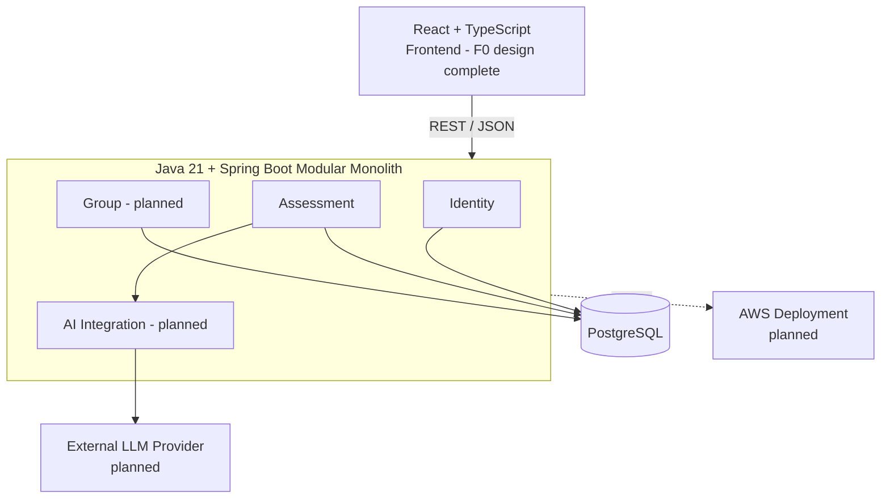

# Spring AWS Portfolio

**English** | [日本語](./README.ja.md)

A production-oriented full-stack cloud portfolio project built around a **non-clinical personality assessment product**.

The application is designed to let users complete versioned personality assessments, resume unfinished attempts, receive deterministic results, optionally clarify ambiguous dimensions, retain assessment history, and eventually share selected completed results with groups under explicit consent.

The project is intentionally developed as an end-to-end engineering exercise rather than a feature-only demo: **domain modeling → API design → persistence → security → testing → frontend → containerization → AWS → CI/CD → Infrastructure as Code**.

> **Current backend:** Assessment **Step 7 complete — deterministic Clarification + Tie-break workflow**<br>
> **Current frontend:** **F0 complete — Integration Baseline + Architecture**<br>
> **Next active focus:** Frontend **F1 — React + TypeScript Foundation**; provider-backed Backend Step 8 remains pending.

---

## Overview

The final MVP combines two main product areas:

1. **Personality Assessment**
   - register and authenticate;
   - start or resume a versioned assessment attempt;
   - autosave questionnaire progress;
   - submit through an immutable business boundary;
   - calculate deterministic scores and ambiguity;
   - optionally resolve ambiguous dimensions through AI-assisted clarification or user tie-break;
   - retain and manage historical completed assessments.

2. **Group & Explicit Sharing**
   - create or join groups;
   - manage membership and admin responsibilities;
   - explicitly select one completed assessment to share with a group;
   - keep questionnaire answers, private clarification context, complete history, and account data private by default.

The product itself is deliberately non-clinical. AI is treated as a constrained supporting component rather than the source of truth for assessment scoring or lifecycle decisions.

---

## Architecture

The system is designed as a **modular monolith** for the MVP. Business modules remain isolated through package boundaries, narrow public contracts, architecture tests, and explicit Application/Domain/Infrastructure separation without introducing microservices prematurely.



### Current backend flow

```text
Register / Login / Session / CSRF
                ↓
        Assessment Catalog
                ↓
      Start / Resume / Restart
                ↓
   Session-bound Questionnaire
                ↓
             Autosave
                ↓
              Submit
                ↓
 Deterministic Scoring + Ambiguity
                ↓
   ┌────────────┴─────────────┐
   │                          │
No ambiguity              Ambiguous
   │                          │
   ↓                          ↓
Complete           Clarification lifecycle boundary
                              ↓
                     Skip current / remaining
                              ↓
                     Exact tie if unresolved?
                              ↓
                       User Tie-break
                              ↓
                           Complete
                ↓
History → Historical Detail

Provider-backed AI conversation remains Backend Step 8.
```

For the detailed architecture baseline, see [`docs/architecture.md`](docs/architecture.md).

---

## Engineering Highlights

This project is intended to demonstrate more than basic CRUD implementation. The main engineering decisions currently represented in the codebase are:

### 1. Versioned assessment execution

Every `AssessmentSession` binds to one exact `AssessmentDefinitionVersion`. A running or historical attempt never silently upgrades when the assessment definition changes.

This makes deterministic assessment behavior explainable and keeps historical results tied to the specification that actually produced them.

See [`ADR-0002`](docs/adr/ADR-0002-bind-session-to-exact-definition-version.md).

### 2. Deterministic core with bounded AI assistance

Questionnaire scoring and ambiguity detection are deterministic. AI clarification is only eligible for dimensions that the deterministic calculation has already classified as ambiguous.

The LLM therefore does **not** own scoring, assessment lifecycle transitions, or final business invariants.

See [`ADR-0003`](docs/adr/ADR-0003-deterministic-scoring-with-optional-ai.md) and [`ADR-0004`](docs/adr/ADR-0004-dimension-scoped-clarification.md).

### 3. Separate initial and final results

The domain distinguishes deterministic evidence from the final assessment outcome. `InitialAssessmentResult` is immutable and cannot be rewritten by later clarification.

This preserves traceability between the original questionnaire result and any later clarification/tie-break decision.

See [`ADR-0005`](docs/adr/ADR-0005-separate-initial-and-final-results.md).

### 4. Concurrency invariants enforced by PostgreSQL

Critical workflow rules are not delegated to frontend checks or in-memory state. The backend combines local transactions, targeted row locking, constraints, and PostgreSQL partial unique indexes for invariants such as one active Assessment Session per user and assessment definition.

See [`ADR-0013`](docs/adr/ADR-0013-targeted-locking-and-partial-unique-indexes.md).

### 5. Domain model separated from JPA persistence model

Domain objects are kept separate from JPA entities so persistence mapping does not become the domain model by default. Repository adapters translate between the two boundaries.

See [`ADR-0010`](docs/adr/ADR-0010-separate-domain-and-jpa-models.md).

### 6. Real PostgreSQL integration testing

Persistence and concurrency integration tests run against real PostgreSQL through **Testcontainers** rather than H2 because the implementation depends on PostgreSQL-specific behavior such as JSONB, partial indexes, constraints, and row locking.

### 7. Server-side authentication with explicit CSRF protection

Authentication uses Spring Security with server-side sessions persisted by Spring Session JDBC. CSRF remains enabled for state-changing browser requests instead of being disabled for convenience.

See [`ADR-0014`](docs/adr/ADR-0014-server-side-session-authentication.md).

### 8. Clarification as an independently persisted workflow

Implementation feedback led to `DimensionClarification` becoming a separate Assessment Aggregate instead of remaining an in-memory child of `AssessmentSession`. Short Session locks, local transaction boundaries, and database uniqueness constraints coordinate the two lifecycles without holding a database transaction across an external LLM call.

See [`ADR-0016`](docs/adr/ADR-0016-dimension-clarification-separate-aggregate.md).

---

## Tech Stack

| Area | Technology | Current status |
|---|---|---|
| Backend | Java 21, Spring Boot 4.1.1 | ✅ Implemented |
| Security | Spring Security, Spring Session JDBC, CSRF | ✅ Implemented |
| Database | PostgreSQL 18 | ✅ Implemented |
| Persistence | JPA / Hibernate, Flyway | ✅ Implemented |
| API | REST, OpenAPI 3.1 | ✅ Implemented through Assessment Step 7 |
| Testing | JUnit 5, Spring MVC Test, ArchUnit, Testcontainers | ✅ Implemented |
| Local environment | Docker Compose | ✅ PostgreSQL environment implemented |
| Frontend | React + TypeScript | 🚧 F0 architecture complete; F1 implementation next |
| AI integration | External LLM behind an adapter boundary | ⏳ Planned |
| Containerization | Docker application image | ⏳ Planned |
| Cloud | AWS | ⏳ Planned |
| CI/CD | GitHub Actions | ⏳ Planned |
| Infrastructure as Code | Terraform | ⏳ Planned |

---

## Current Project Status

| Workstream | Status |
|---|---|
| Product requirements & architecture baseline | ✅ Complete |
| Sixteen Personality specification | ✅ Complete |
| Group domain design | ✅ Complete |
| Backend module / persistence / API design | ✅ Complete |
| Identity & Authentication | ✅ Complete |
| Assessment catalog + Start / Resume | ✅ Complete |
| Questionnaire autosave + Submit | ✅ Complete |
| Deterministic scoring + ambiguity | ✅ Complete |
| Restart / Start New | ✅ Complete |
| Assessment History + Historical Detail | ✅ Complete |
| Clarification + Tie-break mutation | ✅ Complete |
| External AI adapter / runtime context | ⏳ Planned |
| Historical assessment deletion | ⏳ Planned |
| Group / Membership / Sharing implementation | ⏳ Planned |
| React frontend | 🚧 F0 architecture complete; F1 next |
| Docker application image | ⏳ Planned |
| AWS deployment | ⏳ Planned |
| GitHub Actions CI/CD | ⏳ Planned |
| Terraform infrastructure | ⏳ Planned |

The detailed roadmap is maintained in [`docs/roadmap.md`](docs/roadmap.md).

---

## Implemented Backend Capabilities

### Identity & Security

- user registration;
- login and logout;
- authenticated `/me` identity context;
- Spring Security server-side Session authentication;
- Spring Session JDBC persistence;
- CSRF token endpoint and validation;
- Argon2id password hashing behind an Infrastructure adapter.

### Assessment

- available Assessment catalog;
- exact DefinitionVersion binding;
- Start / Resume;
- explicit Restart / Start New;
- Session-bound questionnaire reads;
- questionnaire autosave;
- immutable submission boundary;
- deterministic scoring;
- ambiguity detection;
- immediate finalization when clarification is unnecessary;
- persisted Clarification lifecycle and stale external-result protection;
- Skip Current / Skip Remaining deterministic clarification mutations;
- explicit exact-tie user decision and deterministic post-clarification finalization;
- completed Assessment History;
- historical Assessment detail;
- PostgreSQL-backed read projections;
- retry / concurrency / recovery coverage for implemented critical paths.

Not yet implemented in the executable backend are provider-backed LLM interaction, historical deletion orchestration and Group/Sharing. Frontend implementation begins at F1; cloud deployment also remains pending.

---

## Documentation

The repository treats architecture and implementation decisions as first-class project artifacts rather than keeping them only in code comments.

```text
docs/
├── README.md                 Documentation entry point
├── requirements.md           Product goals, MVP scope and privacy rules
├── architecture.md           System and module architecture baseline
├── roadmap.md                Current progress and remaining work
├── domain/                   Assessment and Group domain design
├── api/
│   └── openapi.yaml          Machine-readable HTTP contract
├── adr/                      Architecture Decision Records
├── backend/                  Detailed backend design and implementation checkpoints
└── frontend/                 Frontend F0 architecture/integration baseline
```

Recommended starting points:

- [`docs/README.md`](docs/README.md) — documentation index;
- [`docs/architecture.md`](docs/architecture.md) — architecture and system boundaries;
- [`docs/domain/assessment-domain.md`](docs/domain/assessment-domain.md) — Assessment lifecycle and invariants;
- [`docs/domain/group-spec-aligned.md`](docs/domain/group-spec-aligned.md) — Group, membership and sharing rules;
- [`docs/api/openapi.yaml`](docs/api/openapi.yaml) — current OpenAPI contract;
- [`docs/adr/`](docs/adr/) — major design decisions and trade-offs;
- [`docs/backend/15-assessment-clarification-workflow-checkpoint.md`](docs/backend/15-assessment-clarification-workflow-checkpoint.md) — latest accepted backend checkpoint;
- [`docs/frontend/README.md`](docs/frontend/README.md) — Frontend F0 design checkpoint and implementation handoff.

---

## Testing Strategy

The backend uses different test levels for different responsibilities:

- **Domain tests** — business rules and state transitions without Spring or database dependencies;
- **Application tests** — use-case orchestration and boundary behavior;
- **Web MVC tests** — HTTP/security/controller contracts;
- **PostgreSQL integration tests** — JPA mappings, Flyway schema, constraints, JSONB and query behavior;
- **Concurrency tests** — locking, uniqueness and retry/recovery behavior on critical workflows;
- **Architecture tests** — package/module dependency guardrails.

Run the backend test suite with:

```bash
cd backend
./mvnw test
```

---

## Running Locally

### Prerequisites

- JDK 21;
- Docker + Docker Compose;
- Internet access on the first Maven Wrapper run.

### 1. Start PostgreSQL

From the repository root:

```bash
docker compose up -d postgres
```

Check container health:

```bash
docker compose ps
```

### 2. Run the backend

```bash
cd backend
./mvnw spring-boot:run
```

Then verify the application:

```bash
curl http://localhost:8080/actuator/health
```

Expected response:

```json
{"status":"UP"}
```

### 3. Run tests

```bash
cd backend
./mvnw test
```

---

## Database Ownership & Migration History

**Flyway owns the database schema.** Hibernate validates the mapped model but does not create or mutate production schema:

```text
spring.jpa.hibernate.ddl-auto=validate
```

Current migration history:

```text
V1__create_identity_tables.sql
V2__create_spring_session_tables.sql
V3__create_assessment_tables.sql
V4__seed_sixteen_personality_v1.sql
V5__add_clarification_execution_token.sql
```

Applied migrations are treated as immutable history and are not renumbered to match older design documents. Future database work begins at `V6` or later.

---

## Repository Structure

```text
spring-aws-portfolio/
├── backend/                  Java 21 + Spring Boot application
├── docs/                     Requirements, architecture, ADRs and checkpoints
├── infra/
│   └── terraform/            Terraform workspace placeholder for the AWS phase
├── compose.yaml              Local PostgreSQL environment
├── .env.example              Local configuration example
└── README.md
```

The root `frontend/` implementation directory will be added in F1. Its accepted F0 architecture/integration baseline is already recorded under `docs/frontend/`. Deployable Terraform infrastructure remains a later implementation phase.

---

## Design Principles

A few principles guide the project as it evolves:

- **Business rules belong on the backend**, not in frontend assumptions.
- **Durable invariants must survive restarts and concurrency**, so important constraints are enforced in PostgreSQL as well as application/domain logic where appropriate.
- **AI is optional and bounded**; deterministic evidence remains authoritative and explainable.
- **Privacy is explicit**; Group membership never implies consent to share assessment data.
- **Architecture decisions should be explainable**; important trade-offs are recorded as ADRs.
- **Avoid premature complexity**; the MVP uses a modular monolith instead of microservices.
- **Implementation feedback may change the design**, but significant changes are documented instead of silently rewriting architectural history.

---

## Project Goal

This repository is a personal learning and career-transition portfolio project. The goal is not only to make the application work, but to be able to explain the engineering decisions behind it in an interview:

- why the domain is modeled this way;
- where transaction and concurrency boundaries belong;
- why PostgreSQL is used as part of invariant enforcement;
- why the project uses server-side sessions instead of JWT for the MVP;
- how deterministic logic is separated from AI-assisted behavior;
- how testing strategy changes with the type of risk being verified;
- and, in later phases, how the application is containerized, deployed to AWS, automated with GitHub Actions, and provisioned with Terraform.

The final target is a runnable full-stack application with documented architecture, automated tests, CI/CD, AWS deployment, and reproducible infrastructure.
