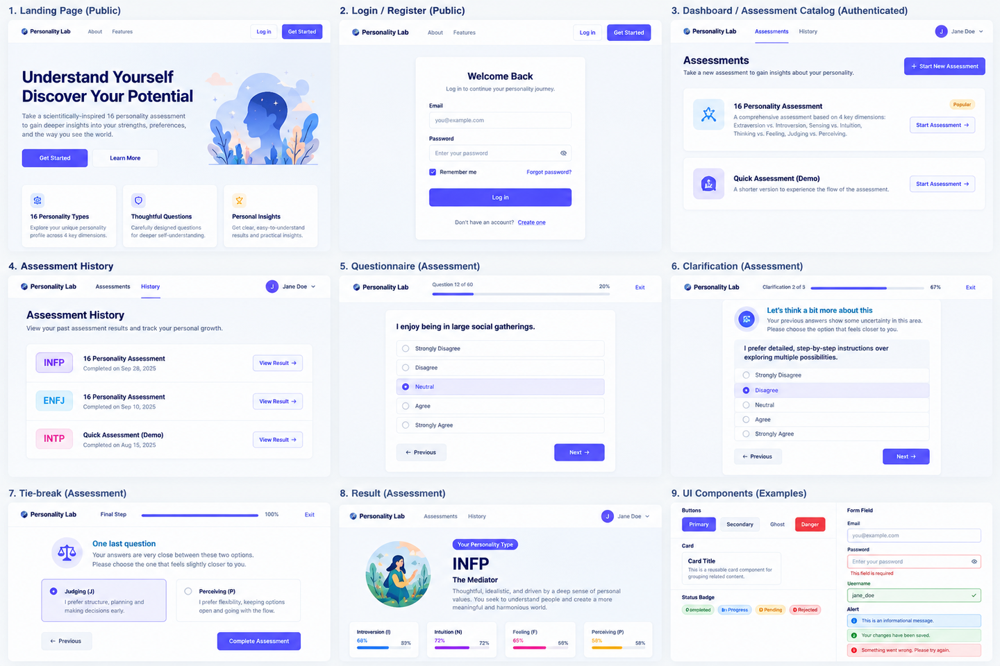
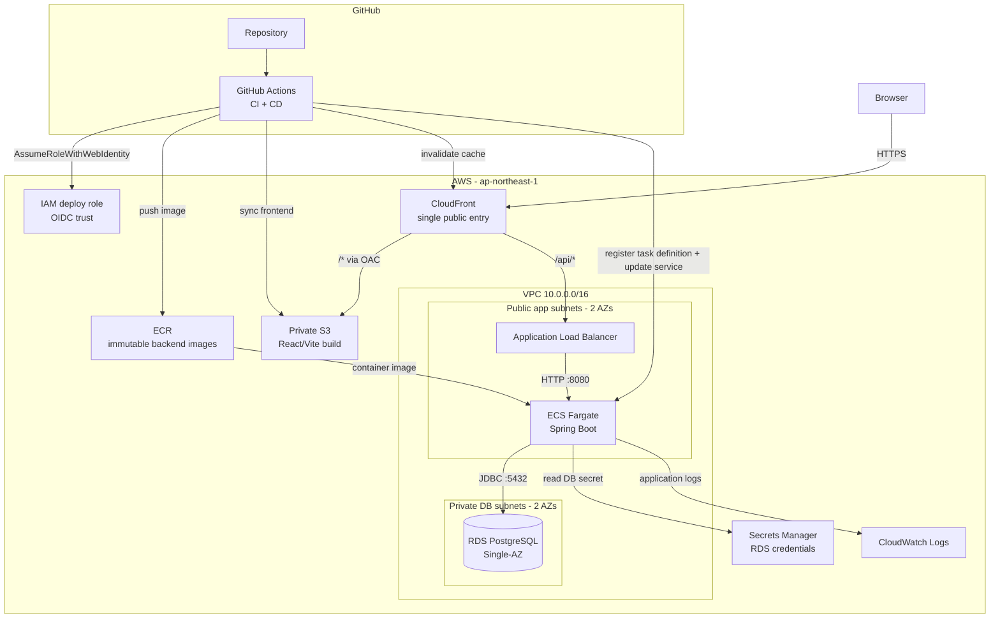
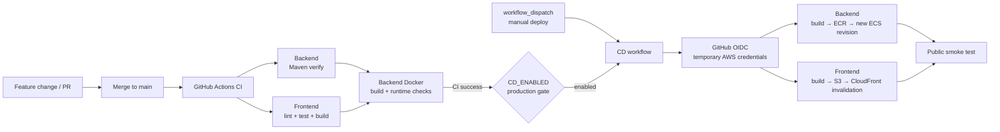

# Spring AWS Portfolio

**English** | [日本語](./README.ja.md)

A production-oriented full-stack cloud portfolio project built around a **non-clinical personality assessment product**.

The application is designed to let users complete versioned personality assessments, resume unfinished attempts, receive deterministic results, optionally clarify ambiguous dimensions, retain assessment history, and eventually share selected completed results with groups under explicit consent.

The project is intentionally developed as an end-to-end engineering exercise rather than a feature-only demo: **domain modeling → API design → persistence → security → testing → frontend → containerization → AWS → CI/CD → Infrastructure as Code**.

> **Live application:** [https://dmvsj5bm8m29k.cloudfront.net/](https://dmvsj5bm8m29k.cloudfront.net/)<br>
> **Current application:** Authentication + deterministic Assessment flow through Result/History is implemented and deployed on AWS; the current release also includes dual-version contextual Tie-break compatibility and the refreshed Result/Landing presentation layer.<br>
> **Current cloud delivery:** Docker, Terraform, RDS, ECR, ECS Fargate, ALB, private S3 + CloudFront, CloudWatch, Secrets Manager, GitHub Actions CI, OIDC and least-privilege CD are implemented.<br>
> **CD status:** Manual deployment and the automatic CI-success → CD path are both verified end-to-end on `main`, including backend/frontend deployment and public smoke tests.<br>
> **Next product focus:** activate DefinitionVersion 1.1, then return to provider-backed LLM clarification and Group/Sharing work.

---

## UI Preview

The repository includes a visual overview of the current frontend presentation layer so the product can be understood directly from GitHub without starting the application locally. The preview covers the public entry experience, authenticated dashboard, assessment workflow, history, and result presentation. Runtime content is populated from backend data.

<p align="center">
  
</p>

**Current visual scope:** Landing & authentication · authenticated app shell · assessment catalog & history · questionnaire progress · clarification / tie-break workflow · final result

---

## Overview

The final MVP combines two main product areas:

1. **Personality Assessment**
   - register and authenticate;
   - start or resume a versioned assessment attempt;
   - autosave questionnaire progress;
   - submit through an immutable business boundary;
   - calculate deterministic scores and ambiguity;
   - optionally resolve ambiguous dimensions through bounded clarification and versioned exact-tie fallback semantics;
   - retain and manage historical completed assessments.

2. **Group & Explicit Sharing**
   - create or join groups;
   - manage membership and admin responsibilities;
   - explicitly select one completed assessment to share with a group;
   - keep questionnaire answers, private clarification context, complete history, and account data private by default.

The product itself is deliberately non-clinical. AI is treated as a constrained supporting component rather than the source of truth for assessment scoring or lifecycle decisions.

---

## Architecture

The MVP uses a **Spring Boot modular monolith** and is deployed as a real AWS full-stack application. CloudFront is the single browser-facing entry point: static React assets come from a private S3 bucket through OAC, while `/api/*` is routed to the Spring Boot backend through an Application Load Balancer.

### Production architecture



The initial production architecture intentionally avoids a NAT Gateway. ECS tasks run in the public app subnets with public IP assignment so they can reach ECR/AWS APIs, but inbound application traffic is restricted by Security Groups to the ALB. RDS stays private. The ALB accepts HTTP only from the AWS-managed CloudFront origin-facing prefix list. These are cost-conscious MVP trade-offs, not claims of maximum isolation.

### CI/CD flow



The CD role uses GitHub OIDC and STS temporary credentials; no long-lived AWS access keys are stored in GitHub. The deploy role is intentionally limited to the ECR repository, ECS deployment actions, the frontend S3 bucket, CloudFront invalidation and exact ECS `iam:PassRole` needs.

Both manual and automatic production CD have been verified end-to-end, including backend rolling deployment, frontend publication and public smoke tests. The automatic path is gated by `CD_ENABLED` and runs only after a successful CI workflow on a `main` push.

### Runtime ownership boundary

Terraform owns the infrastructure baseline: networking, ALB/target group, ECS service, RDS, ECR, S3/CloudFront, logging, IAM and OIDC trust. CD owns application releases: image tags, ECS task-definition revisions, frontend artifacts and CloudFront invalidations. The ECS service therefore treats the deployed task-definition revision as CD-owned drift.

For detailed design and operational notes, see [`docs/architecture.md`](docs/architecture.md), [`docs/deployment/aws-deployment.md`](docs/deployment/aws-deployment.md) and [`docs/deployment/ci-cd.md`](docs/deployment/ci-cd.md).

---

## Engineering Highlights

This project is intended to demonstrate more than basic CRUD implementation. The main engineering decisions currently represented in the codebase are:

### 1. Versioned assessment execution

Every `AssessmentSession` binds to one exact `AssessmentDefinitionVersion`. A running or historical attempt never silently upgrades when the assessment definition changes.

This makes deterministic assessment behavior explainable and keeps historical results tied to the specification that actually produced them.

See [`ADR-0002`](docs/adr/ADR-0002-bind-session-to-exact-definition-version.md).

### 2. Deterministic core with bounded AI assistance

Questionnaire scoring and ambiguity detection are deterministic. AI clarification is only eligible for dimensions that the deterministic calculation has already classified as ambiguous.

The LLM therefore does **not** own scoring, assessment lifecycle transitions, or final business invariants.

See [`ADR-0003`](docs/adr/ADR-0003-deterministic-scoring-with-optional-ai.md) and [`ADR-0004`](docs/adr/ADR-0004-dimension-scoped-clarification.md).

### 3. Separate initial and final results

The domain distinguishes deterministic evidence from the final assessment outcome. `InitialAssessmentResult` is immutable and cannot be rewritten by later clarification.

This preserves traceability between the original questionnaire result and any later clarification/tie-break decision.

See [`ADR-0005`](docs/adr/ADR-0005-separate-initial-and-final-results.md).

### 4. Concurrency invariants enforced by PostgreSQL

Critical workflow rules are not delegated to frontend checks or in-memory state. The backend combines local transactions, targeted row locking, constraints, and PostgreSQL partial unique indexes for invariants such as one active Assessment Session per user and assessment definition.

See [`ADR-0013`](docs/adr/ADR-0013-targeted-locking-and-partial-unique-indexes.md).

### 5. Domain model separated from JPA persistence model

Domain objects are kept separate from JPA entities so persistence mapping does not become the domain model by default. Repository adapters translate between the two boundaries.

See [`ADR-0010`](docs/adr/ADR-0010-separate-domain-and-jpa-models.md).

### 6. Real PostgreSQL integration testing

Persistence and concurrency integration tests run against real PostgreSQL through **Testcontainers** rather than H2 because the implementation depends on PostgreSQL-specific behavior such as JSONB, partial indexes, constraints, and row locking.

### 7. Server-side authentication with explicit CSRF protection

Authentication uses Spring Security with server-side sessions persisted by Spring Session JDBC. CSRF remains enabled for state-changing browser requests instead of being disabled for convenience.

See [`ADR-0014`](docs/adr/ADR-0014-server-side-session-authentication.md).

### 8. Clarification as an independently persisted workflow

Implementation feedback led to `DimensionClarification` becoming a separate Assessment Aggregate instead of remaining an in-memory child of `AssessmentSession`. Short Session locks, local transaction boundaries, and database uniqueness constraints coordinate the two lifecycles without holding a database transaction across an external LLM call.

See [`ADR-0016`](docs/adr/ADR-0016-dimension-clarification-separate-aggregate.md).

### 9. Backend-authoritative React workflow

The frontend keeps stable resource URLs and renders Questionnaire, Clarification, Tie-break and Result as views of the authoritative `AssessmentSessionResponse`. TanStack Query owns server state, unsaved questionnaire edits remain local, and mutations update authoritative Session cache rather than manually advancing a duplicate client state machine.

Real-browser integration also exposed issues that mocked frontend tests alone could not prove, including a Restart response-shape mismatch, React StrictMode autosave lifecycle behavior, and an exact-tie backend response-mapping failure after successful finalization.

See [`docs/frontend/05-implementation-checkpoint-f1-f6.md`](docs/frontend/05-implementation-checkpoint-f1-f6.md).

---

## Tech Stack

| Area | Technology | Current status |
|---|---|---|
| Backend | Java 21, Spring Boot 4.1.1 | ✅ Implemented |
| Security | Spring Security, Spring Session JDBC, CSRF | ✅ Implemented |
| Database | PostgreSQL 18 | ✅ Implemented |
| Persistence | JPA / Hibernate, Flyway | ✅ Implemented |
| API | REST, OpenAPI 3.1 | ✅ OpenAPI v0.5.0 + DefinitionVersion 1.1 compatibility implemented |
| Testing | JUnit 5, Spring MVC Test, ArchUnit, Testcontainers, Vitest, RTL, MSW | ✅ Implemented for current Backend + Frontend scope |
| Local environment | Docker Compose | ✅ PostgreSQL environment implemented |
| Frontend | React + TypeScript, Vite, React Router, TanStack Query | ✅ Auth + Assessment flow through F7-D |
| AI integration | External LLM behind an adapter boundary | ⏳ Next product milestone after the completed cloud foundation |
| Containerization | Multi-stage Docker backend image | ✅ Implemented and deployed |
| Cloud | CloudFront, S3, ALB, ECS Fargate, ECR, RDS, Secrets Manager, CloudWatch | ✅ Deployed in ap-northeast-1 |
| CI/CD | GitHub Actions CI + OIDC + least-privilege CD | ✅ CI + automatic post-CI CD verified end-to-end |
| Infrastructure as Code | Terraform with remote S3 state + native locking | ✅ Implemented for current AWS stack |

---

## Current Project Status

| Workstream | Status |
|---|---|
| Product requirements & architecture baseline | ✅ Complete |
| Sixteen Personality specification | ✅ Complete |
| Group domain design | ✅ Complete |
| Backend module / persistence / API design | ✅ Complete |
| Identity & Authentication | ✅ Complete |
| Assessment catalog + Start / Resume | ✅ Complete |
| Questionnaire autosave + Submit | ✅ Complete |
| Deterministic scoring + ambiguity | ✅ Complete |
| Restart / Start New | ✅ Complete |
| Assessment History + Historical Detail | ✅ Complete |
| Clarification + Tie-break mutation | ✅ Complete |
| External AI adapter / runtime context | ⏳ Planned next after the cloud foundation |
| Historical assessment deletion | ⏸ Deferred until Group sharing backend exists |
| Group / Membership / Sharing implementation | ⏳ Planned product milestone |
| React frontend | ✅ F1-F6 + F7-A–F7-D complete for current executable/staged Assessment scope |
| Docker application image | ✅ Implemented and deployed via ECR/ECS |
| AWS deployment | ✅ Full-stack production deployment verified |
| GitHub Actions CI/CD | ✅ CI + OIDC + automatic post-CI CD verified end-to-end |
| Terraform infrastructure | ✅ Current AWS infrastructure represented with remote state |

The detailed roadmap is maintained in [`docs/roadmap.md`](docs/roadmap.md).

---

## Implemented Backend Capabilities

### Identity & Security

- user registration;
- login and logout;
- authenticated `/me` identity context;
- Spring Security server-side Session authentication;
- Spring Session JDBC persistence;
- CSRF token endpoint and validation;
- Argon2id password hashing behind an Infrastructure adapter.

### Assessment

- available Assessment catalog;
- exact DefinitionVersion binding;
- Start / Resume;
- explicit Restart / Start New;
- Session-bound questionnaire reads;
- questionnaire autosave;
- immutable submission boundary;
- deterministic scoring;
- ambiguity detection;
- immediate finalization when clarification is unnecessary;
- persisted Clarification lifecycle and stale external-result protection;
- Skip Current / Skip Remaining deterministic clarification mutations;
- version-aware exact-tie finalization: retained 1.0 direct-pole semantics plus staged 1.1 contextual question support;
- completed Assessment History;
- historical Assessment detail;
- PostgreSQL-backed read projections;
- retry / concurrency / recovery coverage for implemented critical paths.

Not yet implemented in the executable backend are provider-backed LLM interaction, historical deletion orchestration and Group/Sharing. Historical deletion is intentionally blocked on the Group sharing boundary because active shares must be ended before hard deletion.

### Frontend

- React + TypeScript + Vite application shell;
- Register / Login / current-user Session restoration / protected routes / Logout;
- in-memory CSRF management with stale-token refresh-and-retry;
- Assessment Catalog / Detail / Start / Resume / Start New;
- canonical `/assessment-sessions/:sessionId` workflow route;
- Session-bound questionnaire rendering and persisted-answer restoration;
- debounced serialized full-snapshot autosave with save/error/retry state;
- final Submit coordinated with in-flight autosave and already-submitted recovery;
- deterministic Clarification read model, Skip Current and Skip Remaining;
- dual-version exact-tie UI: retained 1.0 direct-pole flow plus staged 1.1 contextual-question flow without exposing option-to-pole mappings;
- enriched Result interpretation with 8 preference-letter descriptions, 16 type profiles, optimized per-type artwork, and preserved per-dimension decision provenance;
- optimized four-profile Landing hero artwork;
- completed Assessment History, URL pagination and canonical Session detail navigation;
- Vitest / React Testing Library / MSW coverage plus repeated real-browser integration verification.

Still deferred in the frontend are real provider-backed clarification interaction, Group/Sharing UI and historical deletion UI. The AWS deployment and CI/CD foundation is now established, so subsequent feature work can use the deployed environment and delivery pipeline.

---

## Documentation

The repository treats architecture and implementation decisions as first-class project artifacts rather than keeping them only in code comments.

```text
docs/
├── README.md                 Documentation entry point
├── requirements.md           Product goals, MVP scope and privacy rules
├── architecture.md           As-built system/cloud architecture + module boundaries
├── roadmap.md                Current progress and remaining work
├── future-work.md            Deferred options and hardening backlog
├── deployment/
│   ├── aws-deployment.md     Current AWS topology and trade-offs
│   └── ci-cd.md              CI/CD, OIDC and release flow
├── domain/                   Assessment and Group domain design
├── api/
│   └── openapi.yaml          Machine-readable HTTP contract
├── adr/                      Architecture Decision Records
├── backend/                  Detailed backend design and implementation checkpoints
└── frontend/                 Frontend architecture + F1-F7 implementation checkpoints
```

Recommended starting points:

- [`docs/README.md`](docs/README.md) — documentation index;
- [`docs/architecture.md`](docs/architecture.md) — architecture and system boundaries;
- [`docs/domain/assessment-domain.md`](docs/domain/assessment-domain.md) — Assessment lifecycle and invariants;
- [`docs/domain/group-spec-aligned.md`](docs/domain/group-spec-aligned.md) — Group, membership and sharing rules;
- [`docs/api/openapi.yaml`](docs/api/openapi.yaml) — current OpenAPI contract;
- [`docs/adr/`](docs/adr/) — major design decisions and trade-offs;
- [`docs/backend/16-contextual-tie-break-compatibility-checkpoint.md`](docs/backend/16-contextual-tie-break-compatibility-checkpoint.md) — latest Backend compatibility/pre-activation checkpoint;
- [`docs/frontend/README.md`](docs/frontend/README.md) — frontend architecture/implementation index.
- [`docs/frontend/05-implementation-checkpoint-f1-f6.md`](docs/frontend/05-implementation-checkpoint-f1-f6.md) — F1-F6 implementation checkpoint;
- [`docs/frontend/06-result-content-checkpoint-f7c.md`](docs/frontend/06-result-content-checkpoint-f7c.md) — F7-C Result content/image checkpoint;
- [`docs/frontend/07-landing-hero-checkpoint-f7d.md`](docs/frontend/07-landing-hero-checkpoint-f7d.md) — F7-D Landing hero checkpoint;
- [`docs/deployment/aws-deployment.md`](docs/deployment/aws-deployment.md) — deployed AWS topology and trade-offs;
- [`docs/deployment/ci-cd.md`](docs/deployment/ci-cd.md) — CI/CD, OIDC and deployment ownership;
- [`docs/future-work.md`](docs/future-work.md) — future architecture options and deferred work.

---

## Testing Strategy

The project uses different test levels for different responsibilities:

- **Backend Domain tests** — business rules and state transitions without Spring or database dependencies;
- **Backend Application/Web MVC tests** — use-case orchestration, HTTP/security and Controller contracts;
- **PostgreSQL integration tests** — JPA mappings, Flyway schema, constraints, JSONB and query behavior;
- **Concurrency tests** — locking, uniqueness and retry/recovery behavior on critical workflows;
- **Architecture tests** — package/module dependency guardrails;
- **Frontend unit/integration tests** — Vitest + React Testing Library + MSW for browser behavior at the HTTP boundary;
- **Real-browser verification** — manual Browser -> Vite -> Spring Boot -> PostgreSQL checks for the implemented vertical slice.

Run the backend suite with:

```bash
cd backend
./mvnw test
```

Run the frontend quality gates with:

```bash
cd frontend
npm run test
npm run build
npm run lint
```

Dedicated browser E2E automation remains future work. CI/CD now provides a stable deployed environment, so a focused registration → assessment → result smoke scenario can be added when its maintenance cost is justified.

---

## Running Locally

### Prerequisites

- JDK 21;
- Node.js 24 LTS;
- Docker + Docker Compose;
- Internet access on the first Maven Wrapper / npm dependency install.

### 1. Start PostgreSQL

From the repository root:

```bash
docker compose up -d postgres
```

Check container health:

```bash
docker compose ps
```

### 2. Run the backend

```bash
cd backend
./mvnw spring-boot:run
```

Then verify the application:

```bash
curl http://localhost:8080/actuator/health
```

Expected response:

```json
{"status":"UP"}
```

### 3. Run the frontend

In a second terminal:

```bash
cd frontend
npm ci
npm run dev
```

Open:

```text
http://localhost:5173
```

Vite proxies relative `/api` and `/actuator` requests to the backend on port `8080`.

### 4. Run tests / build checks

Backend:

```bash
cd backend
./mvnw test
```

Frontend:

```bash
cd frontend
npm run test
npm run build
npm run lint
```

---

## Database Ownership & Migration History

**Flyway owns the database schema.** Hibernate validates the mapped model but does not create or mutate production schema:

```text
spring.jpa.hibernate.ddl-auto=validate
```

Current migration history:

```text
V1__create_identity_tables.sql
V2__create_spring_session_tables.sql
V3__create_assessment_tables.sql
V4__seed_sixteen_personality_v1.sql
V5__add_clarification_execution_token.sql
```

Applied migrations are treated as immutable history and are not renumbered to match older design documents. Future database work begins at `V6` or later.

---

## Repository Structure

```text
spring-aws-portfolio/
├── backend/                  Java 21 + Spring Boot application
├── frontend/                 React + TypeScript + Vite application
├── docs/                     Requirements, architecture, ADRs and checkpoints
├── infra/
│   └── terraform/            Terraform for the deployed AWS infrastructure
├── compose.yaml              Local PostgreSQL environment
├── .env.example              Local configuration example
└── README.md
```

The deterministic full-stack Assessment slice is runnable locally and deployed on AWS. Terraform represents the current infrastructure baseline, while GitHub Actions provides CI plus verified OIDC-based automatic application delivery.

---

## Design Principles

A few principles guide the project as it evolves:

- **Business rules belong on the backend**, not in frontend assumptions.
- **Durable invariants must survive restarts and concurrency**, so important constraints are enforced in PostgreSQL as well as application/domain logic where appropriate.
- **AI is optional and bounded**; deterministic evidence remains authoritative and explainable.
- **Privacy is explicit**; Group membership never implies consent to share assessment data.
- **Architecture decisions should be explainable**; important trade-offs are recorded as ADRs.
- **Avoid premature complexity**; the MVP uses a modular monolith instead of microservices.
- **Implementation feedback may change the design**, but significant changes are documented instead of silently rewriting architectural history.
