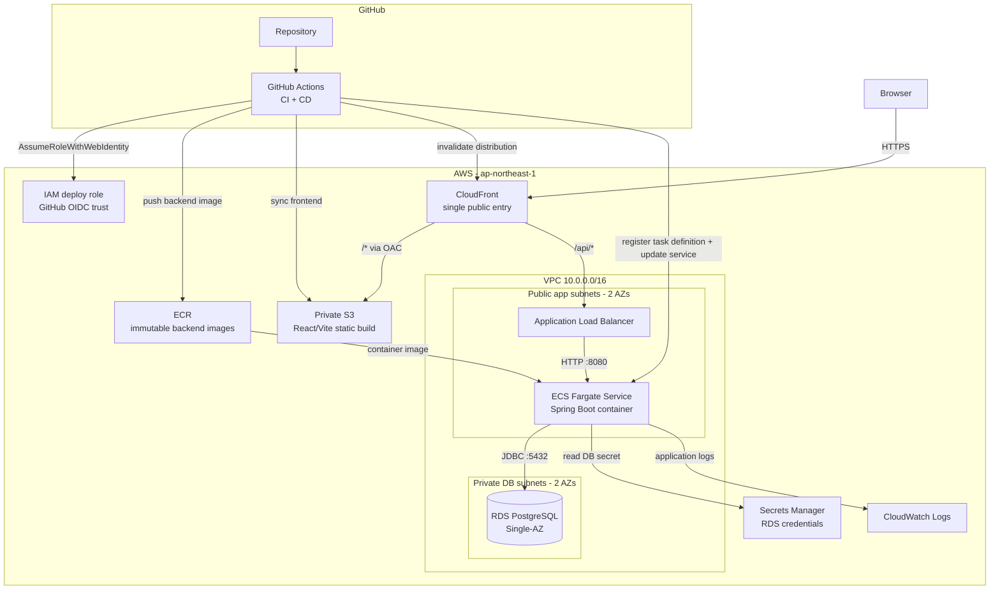
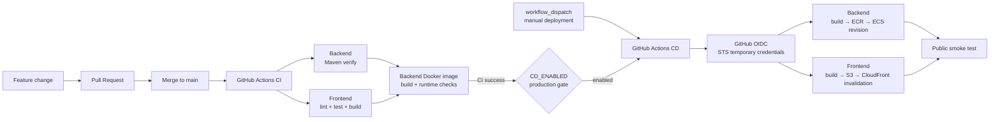

# Architecture

## 1. Purpose

This document is the source of truth for the system-level architecture baseline. It describes business/module boundaries, persistence requirements, major flows, and backend capability boundaries without fixing SQL tables, REST endpoints, Spring classes, JPA mappings, or detailed AWS topology.

## 2. As-Built Production Architecture

The current system is no longer only a target architecture: the full-stack application has been deployed and manually verified on AWS in `ap-northeast-1`.

CloudFront is the browser-facing entry point. Static React/Vite assets are served from a private S3 bucket through Origin Access Control (OAC), while `/api/*` is routed to an Application Load Balancer and then to the Spring Boot backend on ECS Fargate.



### 2.1 Networking and exposure

- VPC CIDR: `10.0.0.0/16`.
- Two public app subnets across two Availability Zones host the ALB and the current ECS tasks.
- Two private DB subnets form the RDS subnet group.
- The MVP intentionally has **no NAT Gateway**.
- ECS tasks therefore receive public IPs for outbound access, but application ingress is limited by Security Groups to the ALB on port `8080`.
- RDS is not publicly accessible; PostgreSQL port `5432` is reachable only from the ECS Security Group.
- The ALB listener is HTTP `:80`; inbound access is restricted to the AWS-managed CloudFront origin-facing prefix list.
- Browser traffic is HTTPS to CloudFront. End-to-end TLS to the ALB remains future hardening work together with custom-domain/ACM work.

The decision to run ECS tasks in public app subnets is a deliberate portfolio-MVP trade-off: it avoids the fixed cost of a NAT Gateway while preserving a private database boundary. It should not be presented as the maximum-isolation production topology.

### 2.2 Runtime service topology

- **CloudFront** — single external origin for both frontend and API paths.
- **S3** — private frontend bucket; no S3 website endpoint.
- **ALB** — public load balancer receiving CloudFront-origin traffic.
- **ECS Fargate** — one desired Spring Boot task for the MVP.
- **RDS PostgreSQL** — encrypted Single-AZ database in private DB subnets.
- **ECR** — immutable backend image repository.
- **Secrets Manager** — RDS-managed master credentials consumed by the ECS execution role.
- **CloudWatch Logs** — backend application logs.
- **Terraform** — infrastructure baseline and remote state.
- **GitHub Actions** — CI and application deployment.

## 3. CI/CD Delivery Flow

The repository separates verification from deployment. CI proves a commit is acceptable; CD releases the exact commit to the existing AWS infrastructure.



### 3.1 CI responsibilities

CI currently verifies:

- Backend Java 21 build and test suite with Maven `verify`.
- Frontend install, lint, tests and production build.
- Production frontend bundle does not contain the local backend URL.
- Backend Docker image builds successfully.
- Runtime Docker user is the non-root `spring` user.
- Port `8080` is exposed by the runtime image.

### 3.2 CD responsibilities

CD currently:

- checks out the exact deployment commit;
- builds the backend image for `linux/amd64`;
- assumes an AWS role through GitHub OIDC;
- pushes a unique immutable image tag to ECR;
- reads the currently deployed ECS Task Definition;
- creates a new Task Definition revision with only the backend image changed;
- updates the ECS Service and waits for service stability;
- builds the frontend and syncs it to the private S3 bucket;
- applies long-lived immutable caching to hashed assets;
- creates and waits for a CloudFront invalidation;
- verifies the public frontend root, SPA route and backend CSRF endpoint.

Manual production CD has been verified end-to-end. The automatic `CI success → CD` path is implemented behind the repository variable `CD_ENABLED`; its final live verification is intentionally deferred to the next real feature update.

### 3.3 Deployment security

GitHub does not store long-lived AWS access keys for deployment.

The CD jobs request `id-token: write`, GitHub issues an OIDC token, and AWS STS returns temporary credentials after the role trust policy validates the repository/branch subject and audience.

The deployment role is least-privilege scoped to the capabilities needed by CD:

- authenticate to ECR and push to the backend repository;
- describe/register ECS task definitions and update the backend service;
- `iam:PassRole` only for the ECS task/execution roles and only to `ecs-tasks.amazonaws.com`;
- list/sync the frontend S3 bucket;
- create/read CloudFront invalidations for the tagged project distribution.

### 3.4 Terraform / CD ownership boundary

Terraform owns the infrastructure baseline. CD owns application release revisions.

Conceptually:

```text
Terraform owns
  VPC / subnets / routes / SGs
  ALB / target group
  ECS cluster + service baseline
  RDS
  ECR
  S3 / CloudFront
  IAM / OIDC
  CloudWatch / Secrets integration

CD owns
  backend image tags
  ECS Task Definition release revisions
  ECS service deployment target revision
  frontend build artifacts
  CloudFront invalidations
```

Because the deployed Task Definition revision changes on every release, Terraform must not attempt to roll the ECS Service back to the bootstrap Task Definition revision.

### 3.5 ECS rollout tuning learned from production deployment

The first automated backend rollout exposed a real timing mismatch: Spring Boot needed roughly 100–110 seconds to become fully ready, and the original ECS health-check grace period was too close to the observed startup time.

The deployment baseline was therefore tuned to:

- ECS health-check grace period: **240 seconds**.
- ALB target-group deregistration delay: **60 seconds**.

This is an operational decision derived from measured application startup behavior, not a business-domain rule.

## 4. Architecture Style: Modular Monolith

The deployed backend remains one Spring Boot **Modular Monolith**. Cloud deployment does not change the domain/module architecture.

```text
React + TypeScript
        |
        v
Application-facing Backend Capabilities
        |
        +-------------------------------+
        |               |               |
        v               v               v
Identity & Access   Assessment         Group
                        |
                        v
                  AI Integration
                        |
                        v
                    External LLM

PostgreSQL provides durable business state.
```

Technology baseline:

- React + TypeScript
- Java 21 + Spring Boot
- PostgreSQL
- Docker
- AWS
- GitHub Actions
- Terraform

A single deployable backend is split by business capability rather than by technical layer alone.

Top-level logical modules:

- `Assessment` — Core Domain.
- `Identity & Access` — supporting identity/account/authentication capability.
- `Group` — supporting business module for groups and membership.
- `AI Integration` — supporting integration boundary for external LLM capability.

Cross-module use cases are coordinated by the Application layer. A module does not take ownership of another module's domain model merely because a use case needs information from both.

### Identity & Access naming clarification

`Identity & Access` owns account identity, registration, login/logout, and authentication context. “Access” does **not** mean centralized business authorization. Assessment and Group authorization rules remain owned/enforced by the relevant business capability.

## 4. Module Ownership and Dependency Rules

### 4.1 Identity & Access

Owns:

- User/account identity.
- Email identity.
- Authentication credential state.
- Login/logout authentication context.

It does not own assessment or group business rules.

Assessment and Group use only the minimum user identity information they need, conceptually `UserId`, rather than the full `UserAccount` model.

### 4.2 Assessment

Owns:

- `AssessmentDefinition`.
- `AssessmentDefinitionVersion` and its assessment specification.
- `AssessmentSession` lifecycle.
- Questionnaire response and submission semantics.
- Deterministic scoring and ambiguity evaluation.
- `InitialAssessmentResult`.
- `DimensionClarification` business lifecycle as a separate Assessment Aggregate coordinated with `AssessmentSession` (ADR-0016).
- Explicit exact-tie user decisions (`DimensionTieBreak`) as persisted Assessment-owned business facts.
- `FinalAssessmentResult`.
- Assessment history as a query over persisted sessions.
- Historical assessment deletion as an owner capability.

### 4.3 Group

Owns:

- Group identity/basic lifecycle.
- Membership relationship.
- Join-request workflow.
- Admin/member rules.
- Membership-related authorization semantics.

Group does not own assessment-result source data. The MVP Group capability set has completed its lightweight Domain Review and is frozen in `docs/domain/group-spec-aligned.md`; future changes should be driven by implementation findings or new requirements.

### 4.4 AI Integration

Owns technical interaction with the external LLM/provider boundary.

It may return:

- Generated conversational output.
- A structured clarification candidate/outcome for Assessment to interpret.
- Provider/model identifier.
- Technical error information.

It does **not** decide:

- Whether a dimension is ambiguous.
- Whether clarification is allowed.
- Whether the assessment is complete.
- What lifecycle transition should occur.
- Whether `InitialAssessmentResult` changes.
- The final personality result.

The Assessment domain must not depend on provider-specific SDK/model classes.

## 5. AssessmentDefinition and Versioning

`AssessmentDefinition` represents the long-lived assessment identity, such as `SIXTEEN_PERSONALITY`.

`AssessmentDefinitionVersion` represents one immutable executable specification containing conceptually:

- `QuestionnaireDefinition`.
- `QuestionDefinition[]`.
- `DimensionDefinition[]`.
- `ScoringPolicy`.
- `AmbiguityPolicy`.
- `FinalizationPolicy`.
- expected/default AI `ClarificationPolicy` revision metadata.

A session binds one exact version at creation and never auto-upgrades. In MVP, version lifecycle uses `DRAFT`, `AVAILABLE`, and `RETIRED`, and at most one version per `AssessmentDefinition` may be `AVAILABLE` at a time. Normal Start Assessment therefore resolves one unique executable version without client version selection.

### Executable specification immutability

Once an `AssessmentDefinitionVersion` becomes `AVAILABLE`, its assessment specification is immutable. Publishing a new semantic version retires the previous available version and makes the new version available in one consistent workflow.

Semantic assessment changes require a new `AssessmentDefinitionVersion`. Technical refactors that preserve assessment behavior do not.

## 6. Historical Traceability and Explainability

The architecture requires:

> **Historical traceability and explainability, with reproducibility for deterministic assessment components.**

Deterministic components can be reproducible when their bound specification and frozen inputs are retained, including questionnaire scoring, ambiguity evaluation, and deterministic finalization rules.

LLM clarification is not guaranteed to be strictly reproducible. Recording the same model identifier and policy revision does not imply that a future execution must return identical wording or judgment.

## 7. Conceptual Persistence Requirements

The persistence model must preserve business facts required for resume, history, invariants, recovery, deletion, and provenance. This section does not prescribe physical tables.

### 7.1 Specification facts

The system must retain enough information to interpret historical sessions against the exact bound `AssessmentDefinitionVersion`.

### 7.2 Assessment execution facts

Persist conceptually:

- Session identity and owner identity.
- Bound `AssessmentDefinitionVersion`.
- Session lifecycle state.
- Current pre-submit `QuestionnaireResponse` snapshot for resume.
- Durable fact that the questionnaire has been submitted.
- Immutable `InitialAssessmentResult` once created.
- `DimensionClarification` state and accepted outcome.
- Required `AIProvenance` for accepted AI-assisted results.
- Explicit user tie-break facts for exact-tie dimensions when clarification/skip leaves no final preference.
- Immutable `FinalAssessmentResult` for completed sessions.
- Relevant timestamps/lifecycle facts required by history/recovery.

### 7.3 QuestionnaireSubmitted: three separate concepts

**Domain Event — `QuestionnaireSubmitted`**

Represents that the business-significant submission action occurred.

**Durable Domain Fact — “Questionnaire has been submitted.”**

After a successful Submit transaction commits, the system must continue to know after crash/restart that submission occurred and that the response is frozen. In MVP, submission and all deterministic post-submission processing are atomic: there is no normal committed `submitted-but-not-scored` recovery state.

**Business Boundary — Submit**

```text
mutable assessment-answering phase
        ->
irreversible submitted phase
```

The architecture is **not Event Sourcing** and does not require a complete persisted domain-event log merely because a Domain Event exists.

### 7.4 Durable active-session invariant

`One Active AssessmentSession per User + AssessmentDefinition` is a persistent business invariant. It cannot rely only on:

- Frontend `Get Active Assessment` checks.
- In-memory state.
- A single application process.

`Start Assessment` and related commands must protect this invariant against restart and concurrent requests. Detailed enforcement mechanisms are deferred to Backend/Database Detailed Design.

### 7.5 Data that is not authoritative domain history

MVP does not require persistence of:

- Every questionnaire edit/version.
- Scoring intermediate variables.
- Every AI retry attempt.
- Full LLM provider requests/responses.
- Full AI conversation transcript.
- Frontend page/loading state.
- A duplicate Group-owned copy of Assessment results.

## 8. AI Clarification Runtime and Persistence

AI conversation content is **not authoritative Assessment history** in MVP.

MVP clarification execution is sequential within one `AssessmentSession`: at most one `DimensionClarification` may be `IN_PROGRESS` at a time. Other ambiguous dimensions remain unresolved until the active clarification finishes, is skipped, fails into a retryable state, or otherwise leaves `IN_PROGRESS`. Parallel clarification conversations in the same Session are out of scope.

Each active external execution also has an opaque correlation token persisted only while that Clarification is `IN_PROGRESS`. Retry creates a new token for the same logical Clarification. External completion is accepted only when the returned/internal ticket still matches the current token after Session + Clarification revalidation; older completions are discarded as stale. The token is workflow coordination metadata, not AI conversation history or user-facing provenance.

An active clarification may require temporary/ephemeral runtime conversation context. The implementation may later use memory, cache, temporary persistence, or another mechanism; this architecture baseline intentionally does not choose one.

The system does not guarantee exact resume from the Nth AI message after browser closure, server restart, or runtime-context loss.

If runtime context is lost before an accepted `ClarificationResult` is durably persisted:

- The persisted `AssessmentSession` remains valid.
- The existing `InitialAssessmentResult` remains unchanged.
- The affected dimension can return to a clarification-ready/retryable state and restart clarification. Technical failures are represented as `FAILED_RETRYABLE`, and Retry remains within the same logical `Session + Dimension` clarification lifecycle.
- No incomplete conversation is treated as accepted domain evidence.

After successful clarification, durable business history keeps only:

- Accepted `ClarificationResult`.
- Required `AIProvenance`.
- Necessary summary, if the product uses one.

`AIProvenance` represents the effective successful AI execution provenance associated with the accepted result, not the complete execution/audit trail. At minimum it records conceptually:

- Model identifier.
- AI Clarification Policy revision/version.

Future full AI audit requirements may justify `ClarificationAttempt[]`; MVP does not model it.

## 9. Group Sharing Privacy Boundary

Group membership does not imply assessment-data consent.

Default sharing is **NOT SHARED**.

Group-facing use cases may expose only an explicitly allowed **Shareable Assessment Result** representation. They must not automatically expose:

- Questionnaire responses/answers.
- Complete assessment history.
- Full or partial AI transcript.
- Private clarification context.
- Account/authentication data.

Sharing consent is owned by the Group boundary as `GroupAssessmentShare`. It is bound to one active `GroupMembership` and one explicitly selected completed `AssessmentSession`; one Membership may have at most one ACTIVE Share at a time.

Group and Assessment do not directly depend on each other's internal models. Cross-module sharing use cases are coordinated at the Application/Orchestration layer.

## 10. Backend Business Capability Boundary

Frontend expresses **business intent**. Backend owns business truth, authorization, invariants, and lifecycle transitions.

### 10.1 Identity capabilities

Commands:

- Register Account.
- Login.
- Logout.

Queries:

- Get Current User.

Password reset is optional/deferred.

### 10.2 Assessment capabilities

Commands:

- Start Assessment.
- Replace/abandon an active attempt and start a new attempt when allowed.
- Save/replace Questionnaire progress before submit.
- Submit Questionnaire.
- Start Dimension Clarification.
- Continue Dimension Clarification.
- Retry Current Clarification.
- Skip Current Dimension Clarification.
- **Skip Remaining Clarifications / Decline AI Clarification.**
- Submit Dimension Tie-break when an exact-tie dimension remains unresolved.
- Delete Historical Assessment.

Queries:

- List Available Assessments.
- Get Assessment Introduction.
- Get Active Assessment.
- Get Current Assessment Progress.
- Get Questionnaire for the bound version.
- Get Assessment Result.
- List Assessment History.
- Get Historical Assessment Detail.

Internal operations such as scoring, ambiguity detection, state mutation, and finalization are not directly controlled by frontend APIs.

`Skip Remaining Clarifications` expresses one user intent: all unresolved ambiguous dimensions become skipped according to domain rules. Finalization may then produce `FinalAssessmentResult` only if every dimension has a final preference. If an exact questionnaire tie remains unresolved after `UNCLEAR` or `SKIPPED`, the backend requires an explicit `Submit Dimension Tie-break` command before completion. The tie-break selects one valid pole from the bound `DimensionDefinition`, is persisted as a business fact, and contributes a `FinalDimensionConclusion` with source `USER_TIE_BREAK`.

### 10.3 Group capabilities

The accepted Group Domain specification defines the MVP capabilities.

Commands:

- Create Group.
- Request to Join Group.
- Approve Join Request.
- Reject Join Request.
- Transfer Admin to another ACTIVE Member.
- Leave Group when the actor is not the current Admin.
- Disband Group.
- Start sharing one selected completed Assessment result.
- Replace the currently shared Assessment result.
- Stop sharing.

Queries:

- Get My Groups.
- Get Group Detail.
- Get Group Members.
- Get Pending Join Requests.
- Get My Join Requests.
- View Group shared results / one member's shared result.

MVP invitation can be satisfied by the admin sharing the group code; email invitation is not required.

Historical Assessment deletion is intentionally **not executable yet** even though its Domain/API semantics are designed. The use case is cross-module: it must end every ACTIVE `GroupAssessmentShare` that references the completed Session with reason `ASSESSMENT_DELETED` before hard-deleting the Assessment-owned historical data. Therefore implementation remains deferred until the Group sharing boundary exists; implementing a standalone Assessment delete first would create a fake dependency or later rework.

### 10.4 Frontend application boundary

The first-party React frontend follows the same backend-authoritative principle rather than maintaining a duplicate client workflow model. The original F0 rules have now been implemented and validated through Frontend F6 for the executable Authentication + deterministic Assessment slice:

- routes identify stable resources/navigation intent; `/assessment-sessions/{sessionId}` is the canonical Assessment Session route;
- Questionnaire, Clarification, Tie-break and Result are views of that Session, not independent workflow routes;
- `AssessmentSessionResponse` and its workflow projection drive presentation; frontend logic may choose display precedence but does not decide whether transitions are valid;
- server state is cached in memory (TanStack Query); unsaved form/questionnaire draft state remains local; Session identifiers and assessment data are not copied into browser persistence;
- Session cookies are browser-managed and opaque to React; unsafe requests use the explicit CSRF protocol from ADR-0014;
- the browser uses relative `/api/...` calls and development should preserve a same-origin view through a frontend dev proxy rather than hard-coding backend origins;
- state-changing requests do not use generic automatic retries; recovery follows backend Problem Details codes and authoritative refetch semantics;
- the design-first OpenAPI target may contain not-yet-executable capabilities, so frontend runtime integration must track implemented Controllers/DTOs/Security until the surfaces converge.

Detailed frontend decisions and the current implementation checkpoint live under `docs/frontend/`. The implemented workflow resolver currently infers the single active clarification from `clarifications[].status == IN_PROGRESS`; before provider-backed Step 8 UI is implemented, re-evaluate whether the public workflow projection should expose the active clarification dimension explicitly.

The implemented frontend also keeps Result interpretation on the presentation side without recomputing Domain conclusions: it combines backend initial evidence and final decision provenance into a read model, while `FinalAssessmentResult` remains authoritative.

Completed History uses `/history?page=N` as URL navigation state. Historical detail reuses the canonical `/assessment-sessions/{sessionId}` route; transient “return to History page N” context is Router state rather than resource identity encoded into the Session URL.

The post-F6 presentation refactor preserves this application boundary. Shared design tokens, public/authenticated App Shells and a small domain-independent `shared/ui` primitive set improve visual consistency without becoming a second feature architecture. Layout/page styling, responsive behavior, loading/error/empty states and reduced-motion handling remain presentation concerns; they must not alter business transitions, API meaning, route identity or server-state ownership. A larger third-party UI framework is intentionally not required for the current MVP scope and can be reconsidered only if later UI complexity justifies the additional dependency/abstraction cost.

## 11. Application-Layer Orchestration

The Application layer coordinates multi-module use cases without taking ownership of module-specific rules.

Example: `View Group Member Shared Result`

1. Ask Group whether the requester and target have the required valid membership/access relationship.
2. Ask Assessment for the target's explicitly shareable result representation.
3. Compose the application response.

Application code should not duplicate Group membership invariants or Assessment result rules by inspecting internal aggregate state directly.

## 12. Retry Safety and Recoverability

Irreversible or state-sensitive business commands must have retry-safe and recoverable semantics. Idempotent behavior must be provided where appropriate.

Examples include:

- Submit Questionnaire.
- Replace Active Assessment / Start New.
- Complete/Skip Clarification.
- Delete Historical Assessment.
- Approve Join Request.
- Disband Group.

Example failure case:

```text
Submit Questionnaire
-> backend succeeds
-> response is lost
-> frontend retries
```

The retry must not create duplicate `InitialAssessmentResult`, duplicate clarification lifecycles, or an invalid state transition.

For MVP, questionnaire submission and deterministic post-submission processing are one local transaction. If that transaction does not commit, submission did not happen; if it commits, the submitted fact, `InitialAssessmentResult`, ambiguity/clarification setup, and any immediate finalization are consistent together.

If Submit succeeds but its HTTP response is lost, a retry does not run scoring again: the client receives the stable already-submitted conflict and recovers authoritative state with `Get AssessmentSession`.

`Start New` is also one business intent rather than a client-side abandon-then-create sequence. It identifies the active Session being replaced, atomically transitions that Session to `ABANDONED`, and creates its replacement. A retry against the already-abandoned old Session must not abandon the newly created successor.

This architecture baseline does not prescribe generic `Idempotency-Key` infrastructure; detailed locking, constraints and HTTP recovery behavior are defined by Backend Detailed Design.

## 13. Non-Functional Architecture Principles

- Security and privacy by default.
- Explicit backend authorization for business operations; hidden frontend controls are not security boundaries.
- Data minimization, especially for AI-related personal descriptions.
- Durable enforcement of core business invariants.
- Retry-safe recovery for irreversible commands.
- Deterministic assessment logic must be testable independently of LLM availability.
- Core Assessment domain must remain independent of specific LLM provider SDKs.
- Avoid unnecessary microservices and shared/common business-logic dumping grounds.

## 14. Cloud Deployment Status

The first full-stack AWS deployment is complete and the current as-built topology is documented in Sections 2 and 3.

Validated delivery capabilities include:

- Dockerized Spring Boot backend.
- ECR image storage.
- ECS Fargate backend runtime behind an ALB.
- RDS PostgreSQL in private DB subnets.
- Private S3 frontend hosting through CloudFront OAC.
- Same-origin CloudFront routing for static content and `/api/*`.
- CloudWatch application logging.
- RDS credentials from Secrets Manager.
- Terraform-managed infrastructure with remote S3 state and native locking.
- GitHub Actions CI.
- GitHub OIDC → STS temporary deployment credentials.
- Least-privilege application CD.
- Successful manual end-to-end production CD and public smoke test.

Automatic CD after a successful `main` CI run is prepared but is intentionally waiting for final validation during the next real feature update.

Detailed operational notes live under `docs/deployment/`.

## 15. Remaining Open Questions

After Domain/Backend alignment, the remaining intentionally open questions are limited to:

- Exact temporary AI runtime-context mechanism for multi-turn clarification.
- Detailed future account-deletion/anonymization policy.

The following user-facing policy is now frozen for MVP: normal Result/History APIs expose business outcome/decision-source information but do **not** expose internal model identifier, prompt revision or provider execution metadata. Those provenance facts remain persisted for audit/observability. Group name is immutable in MVP; `RenameGroup` is deferred.

The following are no longer open: `ABANDONED` source states, Group sharing-consent ownership/granularity, Group Admin leave/transfer rules, historical Assessment hard-deletion semantics, physical submitted-state representation, and ClarificationPolicy provenance binding.

## 16. Detailed Design Ownership

This Architecture Baseline intentionally does not duplicate lower-level implementation specifications. The accepted backend decisions for SQL schema, PostgreSQL constraints/locking, JPA mapping, Spring package boundaries and REST resource/action semantics live under `docs/backend/`. Exact HTTP DTO/security schemas are published in `docs/api/openapi.yaml` (currently design contract v0.4.0). Accepted frontend architecture/integration decisions live under `docs/frontend/`.

Still deferred to specialist design:

- temporary LLM streaming/session/cache/runtime-context implementation.
- no longer open: the current AWS architecture is implemented and documented; future hardening options are tracked separately.
