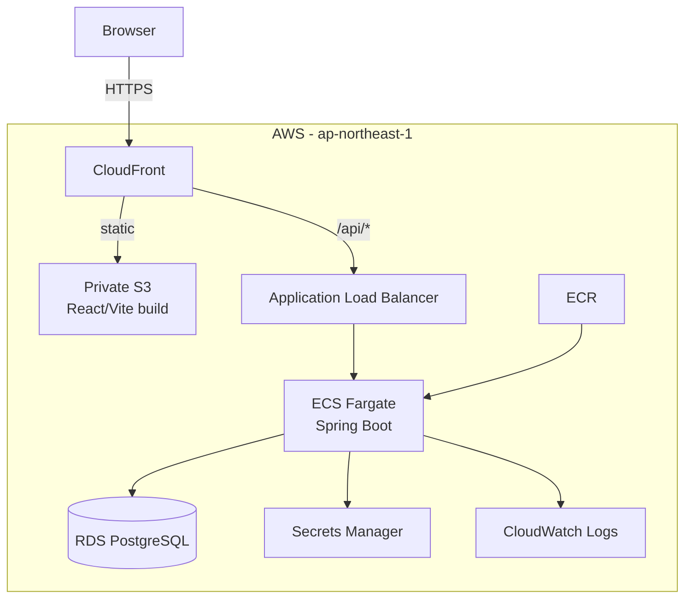

# AWS Deployment

## 1. Purpose

This document records the **current as-built AWS deployment** for the Spring AWS Portfolio project. It is intentionally different from a future target-state document: every component in the main topology below has already been created and used by the deployed application.

Region: `ap-northeast-1`.

## 2. Current production topology

CloudFront provides one browser-facing origin so the React frontend can keep relative `/api` calls while Session cookies and CSRF remain same-origin from the browser perspective.

## 3. Networking

The VPC uses `10.0.0.0/16` across two Availability Zones.

Current subnet layout:

- public app subnet A: `10.0.0.0/24`;
- public app subnet B: `10.0.1.0/24`;
- private DB subnet A: `10.0.20.0/24`;
- private DB subnet B: `10.0.21.0/24`.

The ALB and ECS tasks use the public app subnets. RDS uses the private DB subnet group.

### Why there is no NAT Gateway

The first deployment intentionally avoids a NAT Gateway to keep fixed monthly cost and architecture complexity appropriate for a personal portfolio environment.

ECS tasks therefore use `assign_public_ip = true` for outbound connectivity. This does **not** mean the Spring Boot application is directly exposed: the ECS Security Group accepts port `8080` only from the ALB Security Group.

Alternatives considered:

| Option | Advantages | Trade-offs | Current decision |
|---|---|---|---|
| Public ECS tasks + SG restriction | Low fixed cost, simple outbound access | Tasks have public IPs | **Selected for MVP** |
| Private ECS + NAT Gateway | Stronger network isolation, conventional topology | Significant fixed NAT cost | Future option |
| Private ECS + VPC endpoints | Avoids some NAT traffic/cost | More endpoints, policies and complexity | Future optimization |

## 4. Frontend delivery

The production frontend is built with Vite and stored in a private S3 bucket.

Security and delivery rules:

- bucket public access is blocked;
- S3 website hosting is not used;
- CloudFront reads through Origin Access Control (OAC);
- the bucket policy permits the exact CloudFront distribution;
- hashed assets use long-lived immutable caching;
- HTML/other deployment content uses short/no-cache behavior;
- a CloudFront Function rewrites SPA routes to `/index.html`;
- the rewrite is attached only to the frontend/default behavior, so API 404s are not converted into frontend HTML.

## 5. Backend delivery

The Spring Boot backend is packaged as a multi-stage Docker image and pushed to ECR.

Current runtime baseline:

- Java 21;
- Linux x86_64 Fargate runtime;
- 256 CPU units;
- 1024 MiB memory;
- one desired task for the MVP;
- port `8080`;
- non-root runtime user;
- production Spring profile.

The ECS Service is attached to the ALB target group. The ALB health path is `/actuator/health`.

## 6. Database

RDS PostgreSQL is deployed in the private DB subnet group.

Current cost-oriented baseline:

- PostgreSQL 18;
- Single-AZ;
- encrypted storage;
- not publicly accessible;
- Security Group ingress only from ECS on `5432`;
- Flyway owns schema migration;
- Hibernate validates rather than mutates the production schema.

The master credentials are managed by RDS/Secrets Manager and injected into the ECS task through the execution role. They are not committed to Git or stored as GitHub Actions secrets.

## 7. CloudFront to ALB boundary

CloudFront routes `/api/*` to the ALB with caching disabled. Cookies and the required request metadata are forwarded so server-side Session authentication and CSRF work without switching the application to JWT.

The ALB currently uses HTTP `:80` from CloudFront. Its Security Group restricts ingress to the AWS-managed CloudFront origin-facing prefix list rather than `0.0.0.0/0`.

Known limitation:

- this source restriction identifies CloudFront origin-facing infrastructure globally, not only this project's distribution.

Future hardening options:

1. custom origin header + ALB listener condition;
2. custom domain + ACM certificate and HTTPS between CloudFront and ALB;
3. WAF where its cost/benefit is justified.

## 8. Infrastructure as Code

Terraform owns the AWS infrastructure baseline.

State is stored in an S3 backend with:

- bucket versioning;
- server-side AES256 encryption;
- blocked public access;
- Terraform native S3 lockfile support.

DynamoDB locking is not used.

Application deployment is intentionally **not** performed through a full Terraform apply. See `ci-cd.md` and ADR-0017 for the ownership boundary.

## 9. ECS rollout tuning

The first automated backend rollout exposed a mismatch between application startup time and ECS health timing.

Observed Spring Boot startup was approximately 100–110 seconds, with additional Fargate/container registration time around it. The original 120-second grace period was too tight and caused a healthy application to be recycled during rollout.

Current tuned values:

- `health_check_grace_period_seconds = 240`;
- ALB target-group `deregistration_delay = 60`.

This was validated by a later successful CD run where the new Task Definition reached a stable deployment and the public smoke test passed.

## 10. Current limitations

The following are intentionally not presented as completed production hardening:

- no custom domain yet;
- no ACM certificate on the ALB origin;
- no WAF;
- ECS tasks are not yet private-only;
- RDS is Single-AZ;
- ECS desired count is one;
- no multi-region or disaster-recovery design;
- no autoscaling policy yet.

These are acceptable for the current portfolio MVP and are tracked in `../future-work.md`.

## 11. Destroy / cost awareness

The deployment was intentionally designed to remain destroy-friendly for a personal project.

Examples:

- RDS deletion protection is disabled;
- the current RDS configuration skips a final snapshot;
- the frontend bucket is configured for force-destroy;
- no NAT Gateway is provisioned.

These choices reduce friction and ongoing cost during learning, but they would require reconsideration for a production system containing valuable or regulated data.
