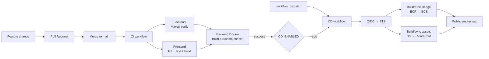

# CI/CD

## 1. Purpose

This document describes the implemented GitHub Actions delivery pipeline and the security/ownership decisions behind it.

## 2. Delivery flow



## 3. CI responsibilities

The CI workflow runs on `main` push, pull request and manual dispatch.

Backend job:

- Java 21;
- Maven dependency cache;
- `./mvnw -B -ntp verify`.

Frontend job:

- Node.js 24;
- `npm ci`;
- lint;
- tests;
- production build;
- reject a production bundle that contains `localhost:8080`.

Docker verification job:

- runs only after backend and frontend jobs succeed;
- builds the backend image;
- checks that the runtime user is `spring`;
- checks that port `8080/tcp` is exposed.

CI does not receive AWS credentials.

## 4. AWS authentication

Deployment uses GitHub OIDC instead of static AWS access keys.

Trust flow:

```text
GitHub Actions job
  -> requests OIDC token
  -> AWS IAM OIDC provider validates issuer/audience
  -> deploy role trust policy validates repository + main branch subject
  -> STS AssumeRoleWithWebIdentity
  -> temporary AWS credentials
```

The repository uses the immutable GitHub repository/owner identity form supported for newer repositories, preventing a renamed or transferred repository from accidentally matching a weaker name-only subject.

## 5. Least-privilege deploy role

The deploy role can perform only the application-release actions currently required.

Backend:

- ECR authorization;
- push layers/images to the backend repository;
- describe the current ECS service and task definition;
- register a new backend Task Definition revision;
- update the backend ECS Service;
- pass only the ECS task and execution roles to `ecs-tasks.amazonaws.com`.

Frontend:

- list the frontend S3 bucket;
- put/delete frontend objects;
- create/read CloudFront invalidations for the intended tagged distribution.

It cannot manage VPCs, modify RDS, read arbitrary secrets, create IAM roles, or administer the AWS account.

## 6. Backend deployment

CD checks out the exact commit being deployed and rebuilds the backend image.

Image tag format:

```text
<git-sha>-<github-run-id>-<run-attempt>
```

Why all three parts are used:

- Git SHA preserves source traceability;
- run ID allows the same commit to be manually deployed more than once;
- run attempt prevents immutable ECR tag collisions when a job is re-run.

The ECR repository uses immutable tags.

After push, CD:

1. resolves the ECS Service's current Task Definition;
2. reads that Task Definition JSON;
3. replaces only the backend container image;
4. strips read-only response fields;
5. registers a new revision;
6. updates the ECS Service;
7. waits for service stability;
8. verifies that the Service points at the expected Task Definition and image.

This preserves runtime configuration such as secrets, environment variables, logging and roles while allowing each application release to create a new revision.

## 7. Frontend deployment

CD independently rebuilds the frontend from the same deployment commit.

Deployment behavior:

- `aws s3 sync --delete` publishes the current distribution;
- default content uses `no-cache`;
- hashed `assets/` content is overwritten with `public,max-age=31536000,immutable`;
- a CloudFront invalidation is created and awaited.

The frontend and backend jobs can run in parallel.

## 8. Public smoke test

The smoke job runs only after both deployment jobs succeed.

It verifies:

- frontend root returns successfully;
- direct SPA route `/login` works through the CloudFront rewrite;
- backend `/api/v1/auth/csrf` is reachable through the same CloudFront entry point.

This is intentionally a lightweight deployment smoke test, not a replacement for browser E2E coverage.

## 9. Manual vs automatic CD

Two entry points exist:

### Manual

`workflow_dispatch` is always available for `main`.

This path has already been validated end-to-end in production:

- backend deploy succeeded;
- frontend deploy succeeded;
- public smoke test succeeded.

### Automatic

A `workflow_run` event listens for successful CI completion on a `main` push.

The additional repository variable `CD_ENABLED` acts as a production gate. It was deliberately kept disabled while the new CD pipeline was being proven.

The automatic path is implemented but its final real-world validation is scheduled for the next feature update. This avoids creating a meaningless change solely to exercise deployment automation.

## 10. Why CI and CD are separate workflows

Alternatives considered:

| Design | Advantages | Trade-offs |
|---|---|---|
| Deployment job inside CI | Simple dependency graph | Mixes verification and privileged deployment |
| Independent CD on every push | Simple trigger | Could deploy before CI result is known |
| **CD via `workflow_run` after CI** | Clear separation and CI gate | Event context is more complex |
| Reusable workflow/orchestrator | Flexible at scale | More abstraction than current project needs |

The current project chooses a separate CD workflow gated by CI success.

## 11. Build artifacts: rebuild vs pass from CI

The current CD rebuilds the Docker image and frontend rather than downloading CI artifacts.

Why:

- less artifact-hand-off complexity;
- clear trust boundary;
- deployment job rebuilds the exact accepted commit;
- AWS credentials are configured only after the build step.

Future optimization could publish signed/attested artifacts once build time or supply-chain requirements justify it.

## 12. Terraform / CD boundary

Terraform creates and configures ECS infrastructure; it does not deploy every application image.

CD creates release Task Definition revisions.

This separation prevents routine application releases from requiring a full infrastructure `terraform apply`, and avoids coupling production releases to unrelated Terraform drift.

See ADR-0017.

## 13. Future improvements

Possible next steps include:

- verify and permanently enable the automatic CD path;
- GitHub Environment approval for production;
- artifact attestations / SBOM / image vulnerability policy;
- browser E2E smoke test after deployment;
- automatic rollback strategy when smoke testing fails;
- deployment notifications;
- pin third-party Actions by commit SHA if supply-chain hardening becomes a priority.
